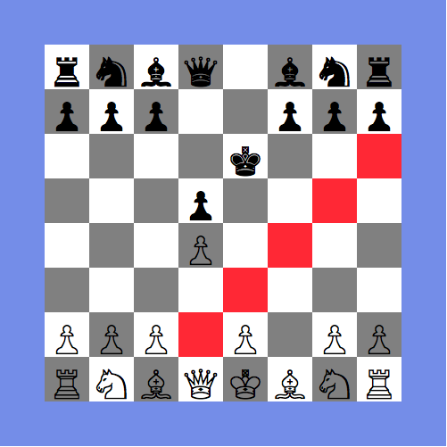

# Chess in the Browser

A chess game complete with checkmate logic and possible move highlighting. The application is built with **React** components that are separated into stateful container components and dumb presentation components. A suite of **Jest** tests are included for the chess logic and compoenent rendering. Live [here](https://malcolmsgroves.github.io/chess-js/)



## Game

The *Game* component serves two purposes: containing the state for the chess game and handling browser events. The game object factory function, called in the constructor, is in a separate module. The component has to handle two types of clicks. If a user clicks on a chess piece, the possible moves are highlighted. If a user clicks on a highlighted square, the selected piece is moved to that square. Changes to the game object are made with pure functions that do not mutate the state. The state is then passed to the dumb *Board* compenent for presentation.

```javascript
class Game extends Component {
  constructor(props) {
    super(props);
    this.state = createGame();
    this.handleClick = this.handleClick.bind(this);
  }
  handleClick(event) {
    const id = parseInt(event.target.id, 10);
    const row = Math.floor(id / 10), col = id % 10;
    const pos = position(row, col);
    if(includesMove(pos, this.state.highlightedMoves)) {
      const newGame = makeMove(this.state.selectedPosition, pos, this.state);
      this.setState(newGame);
    }
    else {
      const moves = legalMoves(pos, this.state);
      this.setState({
        highlightedMoves: moves,
        selectedPosition: pos,
      })
    }
  }

  render() {
    return (
      <Board  onClick={this.handleClick}
              board={this.state.board}
              turn={this.state.turn}
              highlightedMoves={this.state.highlightedMoves}/>
    )
  }
}
```

## Board

The purpose of the *Board* component is to render the game object in the DOM. The componenet does not have state and is purely presentational. All chess pieces are rendered in the DOM, and highlighted positions are colored red. 

```javascript
function Board(props) {

  const boardElement = props.board.map((row, r) => {
    let dark = r % 2 === 0;
    const rowElement = row.map((piece, c) => {
      dark = !dark;
      let colorClass = "";
      if(includesMove(position(r, c), props.highlightedMoves)) colorClass += "highlight-";
      else if(props.selectedPosition &&
              props.selectedPosition.row === r &&
              props.selectedPosition.col === c) colorClass += "selected-";
      if(dark) colorClass += "dark";
      else colorClass += "light";

      return <li  className={ colorClass }
                  key={`${r}${c}`}
                  id={`${r}${c}`}
                  onClick={props.onClick}>{ pieceToHTML(piece) }</li>
    });
    return rowElement;
  });
  return (
    <div className="game">
      <h1>{`${props.turn}'s turn`}</h1>
      <ul className="board">{ boardElement }</ul>;
    </div>
  )
}
```
